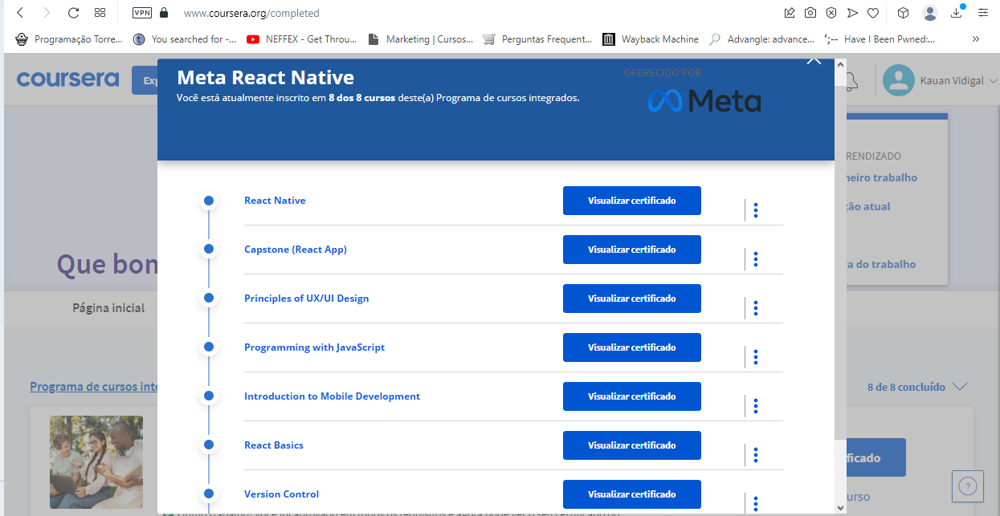

## Meta-React-Native-Certificate

 
<a href="https://www.coursera.org/specializations/meta-react-native?" target="_blank">Click here to see the course</a>

 

 
<a href="https://www.coursera.org/account/accomplishments/specialization/certificate/FCVNZ3U3ZBKG" target="_blank">Click here to see the certificate</a>

 
